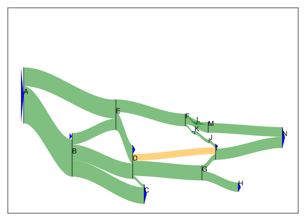
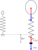
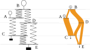
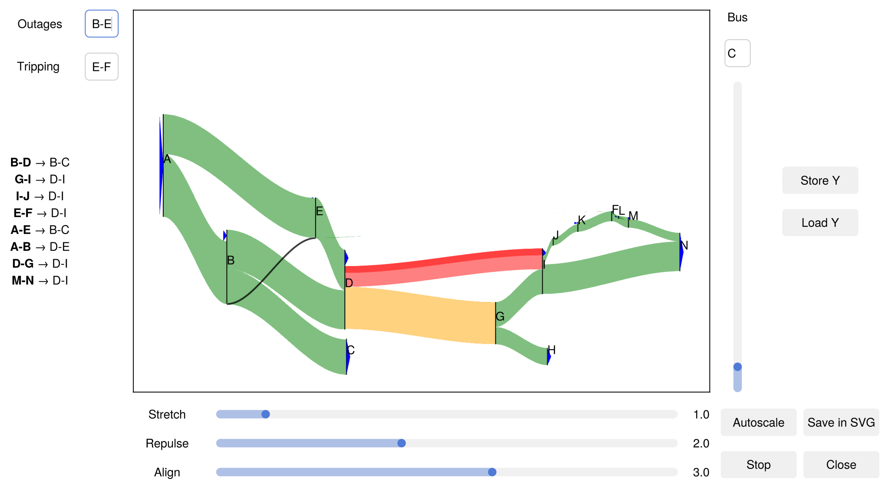

# SankeyPF.jl


**SankeyPF.jl** is a Julia package for visualizing **power flow data** using interactive **Sankey diagrams**.  

<p style="text-align: center"></p>

It provides a convenient interface for exploring how power flows through networks, with nodes and branches rendered dynamically using [GLMakie](https://makie.juliaplots.org/stable/).

It is developed within [CRESYM-OptGrid](https://cresym.eu/optgrid/) project, supervised by TU Delft and sponsored by RTE.

## Features

- Interactive Sankey visualization of DC power flows
- Dynamic topology modification (branch outages & tripping)
- Built-in security analysis visualization
- Adjustable force-based layout
- SVG export support

## Principles
### Layout
Active power flows from higher angle to lower phase angles.
**SankeyPF** arranges phase angles of the buses along the $x$ axis, uses branch flow magnitude to determine the thickness of Sankey bands and uses a force layout algorithm to arrange them along the $y$ axis.

### Mechanical analogy
Recall that in the DC-approximation, the flow $flow = b (\theta_t - \theta_f)$ where $\theta_t$ and $\theta_f$ correspond to the "from" and "to" ends of the branch.
There is a direct analogy between a power system modeled under the DC-approximation where generators connect loads through branches and a mechanical system where helium balloons sustain masses through springs.

<div align="center">

| Mechanical system | Power system |
|:-----------------:|:------------:|
| helium balloon    | generator    |
| mass              | load         |
| spring            | branch       |
| altitude          | phase angle  |
| $force= k (z_t - z_f)$ | $flow = b (\theta_t - \theta_f)$ |  
|   |  |

</div>

With that analogy, the following power grid:
<p style="text-align:center"></p>

translates into the system of springs, and the vertical sankey power flow diagram:

<p style="text-align:center"></p>

### Force layout
When displayed horizontally, the $y$ positions of the buses are calculated with a force layout algorithm to ease readability.
Two forces are involved:
- an attractive one that promotes alignment of connected buses
- a repulsive one that separates buses that are too close.


## 📦 Installation

Clone this repository locally:

```bash
git clone https://github.com/BenoitJeanson/sankeypf.git
cd sankeypf
```

Then open Julia and activate the local project environment:

```julia
using Pkg
Pkg.activate(".")
Pkg.instantiate()
```

This will install all required dependencies listed in `Project.toml`.

Once the environment is instantiated, you can load the package with:

```julia
using SankeyPF
```

## 🧠 Basic Usage

Example scripts can be found in the [`examples/`](./examples) directory.  
To run a demonstration:

```julia
include("examples/demo.jl")
```

This will open an interactive window showing a sample power flow diagram.
<p style="text-align:center"></p>

Branch colors indicate loading relative to thermal limits:
- 0%-80%: green
- 80%-100%: yellow
- \>100% : light red with the excess portion highlighted in bright red.

On the left side of the panel, the **outages** text-box allows opening of multiple branches, while **tripping** is restricted to a single branch opening.</br>
The syntax of a branch is the labels of its terminal buses (order insensitive) separated by ```-```. Multiple branches are separated by ```,```.
E.g. ```A-B, C-D```.</br>
Below a security analysis is displayed taking into account the branches in **outages** : ```A-B → C-D, E-F``` indicates that the tripping of branch *A-B* results in an overloading of branch *C-D* and *E-F*.

The parameters of the force layout algorithm can be adjusted with the **repulse** and **align** sliders.
The **stretch** slider acts as a zoom out on the *y* axis only.</br>
On the right side, the slider forces the vertical position of the given **Bus**.</br>

Finally, buttons:
- **Store Y**: stores the $y$ positions and force layout parameters of into a file named ```tmp/Y_center_$CASE$.csv```.
- **Load Y**: loads the $y$ positions and force layout parameters of into a file named ```tmp/Y_center_$CASE$.csv```.
- **Autoscale**: freezes or unfreezes the autoscaling of the layout
- **Stop**: freezes the force layout
- **Save in SVG**: saves the image in "tmp/sankey_export.svg"
- **Close**


## 📜 License

This project is released under the [APACHE 2.0](LICENSE).


## 📧 Contact

For issues, suggestions, or contributions, please open an [issue](https://github.com/BenoitJeanson/sankeypf/issues) or submit a pull request.
